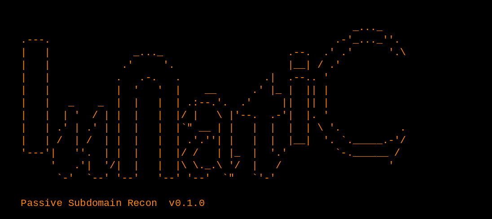

# Lunatic



```

                                                          _..._
  .---.                                                .-'_..._''.
  |   |              _..._                     .--.  .' .'      '.\
  |   |            .'     '.                   |__| / .'
  |   |           .   .-.   .              .|  .--.. '
  |   |           |  '   '  |    __      .' |_ |  || |
  |   |   _    _  |  |   |  | .:--.'.  .'     ||  || |
  |   |  | '  / | |  |   |  |/ |   \ |'--.  .-'|  |. '
  |   | .' | .' | |  |   |  |`" __ | |   |  |  |  | \ '.          .
  |   | /  | /  | |  |   |  | .'.''| |   |  |  |__|  '. `._____.-'/
  '---'|   ''.  | |  |   |  |/ /   | |_  |  '.'        `-.______ /
       '   .'|  '/|  |   |  |\ \._.\ '/  |   /                  '
        `-'  `--' '--'   '--' '--'  `"   `'-'

  Passive Subdomain Recon  v0.1.0

```

Lunatic é uma ferramenta de código aberto, escrita em Go, para descoberta de subdomínios de forma passiva. Ela só consulta bases de terceiros, como logs de Certificate Transparency, arquivos web, DNS passivo e buscadores de ativos. Nunca faz varredura, força bruta, resolução de DNS nem requisição HTTP ao alvo.

## O que aparece na saída

A lista traz nomes vistos em fontes passivas. Isso não confirma que o subdomínio:

- está no ar ou responde agora;
- resolve em DNS;
- pertence mesmo à organização (curingas, certificados compartilhados e dados públicos geram ruído);
- ainda existe: CT e arquivos web guardam registros antigos.

Encare a lista como ponto de partida para a investigação, não como inventário fechado.

## Instalação (Linux / Kali)

Precisa de Go 1.24 ou superior (o `go.mod` pede `go 1.24`). As dependências (`golang.org/x/net` e `golang.org/x/text`) já vêm em `vendor/`, então compilar não precisa de rede.

Instale o Go pelo [go.dev/dl](https://go.dev/dl/) ou, no Kali/Debian, pelo `apt`:

```bash
sudo apt update && sudo apt install golang-go
go version    # confira se é 1.24 ou superior; se for mais antigo, use o go.dev
```

> O pacote `golang-go` de algumas versões do Kali/Debian pode ser mais antigo que 1.24. Nesse caso, instale pelo go.dev.

Baixe o código e compile:

```bash
git clone https://github.com/lunalully/lunatic.git lunatic
cd lunatic

make build        # gera ./bin/lunatic
make install      # compila e instala em /usr/local/bin (ou ~/go/bin se não houver permissão)

# alternativa sem make:
go build -o lunatic ./cmd/lunatic
```

`make install` aceita `PREFIX=/outro/caminho`. Se instalou em `~/go/bin`, confira se ele está no `PATH`.

## Primeiro uso (sem configuração)

Funciona sem nenhuma chave de API; só as fontes gratuitas rodam:

```bash
lunatic -d example.com
```

Use apenas em domínios que você tem autorização para investigar. A consulta é passiva, mas o resultado é informação sobre um alvo.

## Exemplos

```bash
lunatic -d example.com                                   # fontes padrão, resultado no terminal
lunatic -d example.com -o subdominios.txt                # também grava em arquivo (texto)
lunatic -dL dominios.txt -o resultados.txt               # lista de domínios (um por linha)
lunatic -d example.com -s crtsh,commoncrawl,waybackarchive   # somente estas fontes
lunatic -d example.com --all                             # todas as fontes não desabilitadas
lunatic -d example.com --json -o resultados.jsonl        # JSON Lines (só domain e subdomain)
lunatic -d example.com --json --show-sources             # JSON Lines com a lista de fontes por nome
lunatic -d example.com -v                                # mostra o resumo por fonte (ok/skipped/failed)
lunatic -d example.com --silent                          # só os resultados, ideal para pipes
lunatic --list-sources                                   # tabela de fontes, status e variáveis
lunatic --help
lunatic --version
```

`-d` pode ser repetido ou receber vários domínios separados por vírgula (`-d a.com,b.com`). Em `-dL`, linhas vazias e linhas começadas por `#` são ignoradas.

## Flags

Valores padrão conforme `internal/cli/cli.go`.

| Flag | Descrição | Padrão |
|---|---|---|
| `-d domínio` | Domínio alvo (repetível ou separado por vírgulas) | - |
| `-dL arquivo` | Arquivo com um domínio por linha (`#` comenta) | - |
| `-s lista` | Roda apenas estas fontes (nomes separados por vírgula) | fontes padrão |
| `-es`, `--exclude-sources lista` | Pula estas fontes | nenhuma |
| `--all` | Usa todas as fontes não desabilitadas (as sem chave aparecem como "skipped" com `-v`). Não combina com `-s` | desligado |
| `--list-sources` | Imprime a tabela de fontes e sai | - |
| `-o arquivo` | **Também** grava os resultados no arquivo (criado/truncado, permissão 0644) | - |
| `--json`, `-oJ` | Saída JSON Lines | texto |
| `--show-sources` | Com `--json`, inclui o array `sources` em cada registro (o texto sempre traz só os nomes) | desligado |
| `--silent` | Só resultados no stdout; também esconde o banner (e ignora `-v`) | desligado |
| `--config caminho` | Arquivo YAML de credenciais | `$XDG_CONFIG_HOME/lunatic/config.yaml` ou `~/.config/lunatic/config.yaml` |
| `--timeout segundos` | Tempo limite **por fonte** e por domínio (mínimo 1) | `90` (segundos) |
| `--max-time minutos` | Tempo limite total da execução; `0` = sem limite | `10` (minutos) |
| `--concurrency n` | Fontes rodando ao mesmo tempo (mínimo 1) | `10` |
| `-v`, `--verbose` | Mostra progresso, avisos de configuração e o resumo por fonte (ok/skipped/failed com motivos) no stderr; segredos redigidos. Sem `-v` o stderr mostra só o banner | desligado |
| `--no-color` | Desativa cores (também: `NO_COLOR`, `TERM=dumb`, stderr fora de TTY) | cores automáticas |
| `--version` | Imprime a versão e sai | - |
| `-h`, `--help` | Mostra a ajuda | - |

Nomes de fontes desconhecidos em `-s` ou `--exclude-sources` geram erro de uso (código 1) com a lista de nomes válidos.

## Fontes gratuitas e fontes com restrição

O que roda em cada modo (a lista completa e o estado atual saem em `lunatic --list-sources`):

- Execução padrão (sem `-s` nem `--all`): fontes marcadas como padrão e utilizáveis.
  - Gratuitas e sem chave: anubis, crtsh, scanmalware, shodanct, subdomaincenter, thc, threatminer, waybackarchive.
  - Chave opcional (rodam sem ela; a chave amplia a cota): alienvault, certspotter, hackertarget, submd, urlscan.
  - Segunda fase: internetdb só consulta IPs que outras fontes já devolveram. Sem IPs coletados, não faz requisição nenhuma; nunca resolve DNS nem contata os hosts.
  - Chave obrigatória: entram na execução padrão só quando a chave está configurada; sem ela, aparecem como "needs key" e são puladas.
- Fora do padrão (só com `-s nome` ou `--all`): arquivopt, commoncrawl, digitorus, rapiddns e sitedossier (gratuitas, mas pesadas, instáveis ou baseadas em raspagem de HTML), além de threatbook e zoomeyeapi, que exigem chave.
- `--all`: todas as fontes não desabilitadas. As que precisam de chave e não têm aparecem como `skipped (missing credentials: ...)` no resumo do `-v`.
- Desabilitadas (binaryedge, censys, chinaz, domainsproject, hudsonrock, robtex, threatcrowd): ficam registradas para cobertura, mas nunca contatam a rede, nem com `-s`. Os motivos estão em [docs/SOURCES.md](docs/SOURCES.md).

Detalhes de cada fonte (endpoint, plano, limites e situação de verificação) ficam em **[docs/SOURCES.md](docs/SOURCES.md)**.

## Formatos de saída

Os resultados vão sempre para o stdout. Com `-o arquivo`, os mesmos dados também são gravados no arquivo (criado ou truncado), no formato escolhido (`--json` ou texto). Os dados nunca levam ANSI, banner ou resumo, e são escritos no fim da execução, não em fluxo contínuo.

Texto (padrão): um subdomínio por linha, sem repetições.

```
api.example.com
www.example.com
```

JSON Lines (`--json`): um objeto por linha, só com `domain` e `subdomain` (sem nomes de fontes).

```json
{"domain":"example.com","subdomain":"api.example.com"}
{"domain":"example.com","subdomain":"www.example.com"}
```

Com `--json --show-sources`, cada registro ganha o array `sources` com as fontes que viram o nome (a saída de texto nunca inclui fontes):

```json
{"domain":"example.com","subdomain":"api.example.com","sources":["crtsh","waybackarchive"]}
```

## stdout e stderr

| Fluxo | Conteúdo |
|---|---|
| stdout | Apenas os resultados (dados) |
| stderr | Só o banner (apenas se stderr for um terminal) e erros fatais de uso/configuração. Nenhum nome de fonte, falha, aviso ou contagem aparece por padrão; com `-v` surgem o progresso, os avisos e o resumo por fonte |

Com `--silent`, o stderr só recebe erros fatais (sem banner). Assim `lunatic ... > saida.txt` e `| outro-programa` recebem só dados.

## Códigos de saída

| Código | Significado |
|---|---|
| `0` | Todas as fontes tentadas tiveram sucesso (zero resultados conta como sucesso) |
| `1` | Erro de uso, entrada ou configuração (nada foi executado) |
| `2` | Nenhuma fonte teve sucesso (todas falharam, foram puladas ou nenhuma era utilizável) |
| `3` | Sucesso parcial: ao menos uma fonte teve sucesso e ao menos uma falhou |
| `130` | Interrompido (SIGINT/SIGTERM); resultados parciais ainda são escritos |

Fontes puladas (sem chave ou desabilitadas) não contam como falha para o código `3`.

Como a saída é limpa por padrão, o código de saída é o sinal de que alguma fonte falhou (`3` parcial, `2` nenhuma teve sucesso). Rode com `-v` para ver quais.

## Falhas, resultados vazios e registros antigos

Por padrão o Lunatic não imprime nada sobre as fontes. Para ver o que aconteceu, use `-v`: o resumo (no stderr) lista cada fonte como `ok N`, `skipped (motivo)` ou `failed (tipo): mensagem`. Tipos de falha: `no_key`, `auth` (chave inválida ou plano sem acesso), `rate_limited` (cota ou limite de taxa), `timeout`, `unexpected` (formato de resposta inesperado, provedor mudou), `unavailable` (5xx, desafio anti-bot), `blocked` (guarda passiva) e `canceled`.

- Resultado vazio não é erro: um domínio pequeno pode simplesmente não aparecer nas fontes.
- Falha parcial (código `3`) é comum, porque fontes gratuitas como o crt.sh oscilam. Rode de novo com `-v` para ver o que falhou e aumente `--timeout` se precisar.
- `auth` costuma ser chave inválida ou plano sem acesso ao endpoint. `unexpected` pode indicar que o provedor mudou o formato; veja como reportar na seção de contribuição.
- Nomes históricos: CT e arquivos web guardam registros antigos, então um nome listado pode ter sido desativado anos atrás.
- Serviços de terceiros limitam a cota gratuita e podem truncar resultados sem avisar (veja [docs/SOURCES.md](docs/SOURCES.md)).

## Limites passivos (garantias do projeto)

- Sem força bruta de nomes.
- Sem resolução de DNS dos resultados.
- Sem HTTP para o alvo: todo acesso de rede passa por um único cliente (`internal/httpx`), que recusa qualquer requisição ao domínio-alvo ou aos subdomínios dele.
- Redirecionamentos para o alvo são bloqueados; no máximo 3 saltos e só para o mesmo host (ou de http para https no mesmo host).
- Nada de seguir links encontrados nos resultados nem disparar jobs/scans nos provedores. Só nomes saem nos resultados (sem e-mails, IPs ou dados pessoais); IPs devolvidos por uma fonte são apenas repassados às fontes de fase 2 e não ficam salvos.
- Fontes de raspagem (digitorus, rapiddns, sitedossier) nunca contornam CAPTCHA ou desafios anti-bot.

## Integração com pipes

Com `--silent` a saída é só dados:

```bash
lunatic -d example.com --silent | sort -u > subs.txt
```

> Atenção: o Lunatic é passivo, mas o que você encadear no pipe pode ser ativo (resolver DNS, mandar requisições aos hosts). Use em alvos para os quais você tem autorização explícita.

## Como adicionar e testar uma nova fonte (adaptador)

Resumo; as regras completas estão em [docs/DEVELOPMENT.md](docs/DEVELOPMENT.md) e [CONTRIBUTING.md](CONTRIBUTING.md).

1. Crie exatamente estes arquivos: `internal/sources/<nome>.go`, `internal/sources/<nome>_test.go` e fixtures em `internal/sources/testdata/<nome>/`.
2. Declare a URL base como **variável de pacote** (os testes a reatribuem): `var nomeBaseURL = "https://api.exemplo.com"`.
3. Registre no `init()`: `func init() { Register(nome{}) }`. Nomes são minúsculos e únicos (duplicado causa panic).
4. Preencha `Info()`: `Name`, `URL`, `Auth` (`AuthNone`, `AuthOptional`, `AuthRequired`), `CredFields` (obrigatórios) e `OptCredFields` (opcionais), `Default`, `RPS`, `Burst`. Fonte que exige chave só deve ser `Default` se a chave for opcional (a execução padrão a pula sem chave). Fontes inviáveis: `Disabled: true` com `DisabledReason`, e `Enumerate` retorna `ErrDisabled`.
5. Faça todas as requisições por `s.HTTP` (nunca `net/http` direto). Retorne erros tipados (`ErrNoKey`, `ErrAuth`, `ErrRateLimited`, `ErrTimeout`, `ErrUnexpected`, `ErrUnavailable`, `ErrBlockedHost`, `ErrDisabled`). Credenciais via `PickKey(s.Creds, "api_key")`. Emita nomes crus com `emit(...)`; o runner normaliza, filtra o escopo e remove duplicatas.
6. Testes offline com `httptest` e fixtures: sucesso, resultado vazio, parada em `MaxPages`, 401 para `ErrAuth`, limite de taxa, JSON malformado para `ErrUnexpected` e chave ausente. **Nunca** acesse a rede em testes.
7. Rode `make test` (e `make check` antes de abrir PR: `go vet`, testes, `-race`, `gofmt`).
8. Documente a fonte em `docs/SOURCES.md` e, se houver credenciais, em `config.example.yaml`.

## Licença

MIT. Veja [LICENSE](LICENSE). Copyright (c) 2026 Lunatic contributors.
